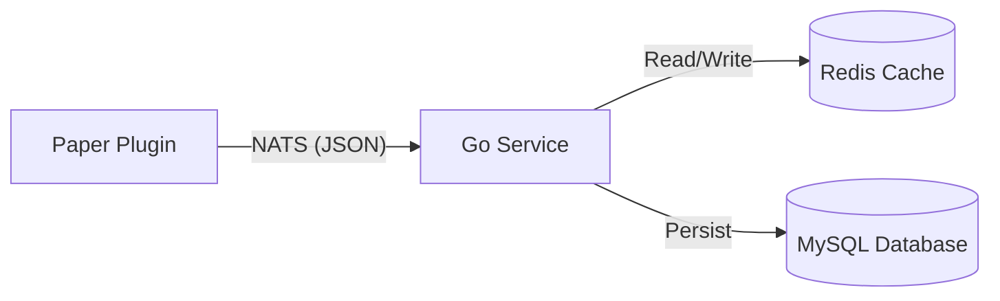

# 🚀 GoAuth: High-Performance Minecraft Authentication


**GoAuth**, Minecraft sunucuları (Paper/Velocity) için tasarlanmış; ölçeklenebilir, mikroservis mimarili ve son derece hızlı bir kimlik doğrulama sistemidir.

Geleneksel pluginlerin aksine, veritabanı işlemlerini Java ana iş parçacığında (Main Thread) **yapmaz**. Tüm ağır yükü (Hashing, SQL I/O) **Go Backend** servisine yıkar ve iletişim için **NATS** mesajlaşma sistemini kullanır.

## 🌟 Özellikler

* **⚡ Şimşek Hızında:** Redis önbellekleme sayesinde anlık veri okuma ve "Session" yönetimi.
* **🛡️ Asenkron Mimari:** NATS (Request-Reply) kullanarak sunucuda **0 Lag** (TPS düşüşü yaşanmaz).
* **🔒 Yüksek Güvenlik:** Şifreler `bcrypt` algoritması ile izole edilmiş Go servisinde hashlenir.
* **🐳 Docker Ready:** Tek komutla (`docker-compose up`) tüm altyapı (MySQL, Redis, NATS, Go API) ayağa kalkar.
* **🔄 Ölçeklenebilir:** Birden fazla Minecraft sunucusu (Lobi, SkyBlock, Towny) aynı backend'e bağlanabilir.

## 🏗️ Mimari Tasarım

Sistem, modern mikroservis prensipleriyle çalışır:



## 📦 Gereksinimler
* **Docker**

* **Docker Compose**

* **(Opsiyonel) Go 1.22+**

* **Minecraft Paper 1.21.4**
  
## 🐳 Docker ile Kurulum
```bash
git clone https://github.com/benerenla/atlas-altayapi.git
cd atlas-altayapi
docker compose up -d
```
Serviesler:
* Go Service → `:8080` (örnek)
* Nats → `:4222`
* Redis → `:6379`
* MySQL → `:3306`
  
## 🧪 Lokal Geliştirme
```bash
go mod tidy
go run main.go
```

## 📂 Proje Yapısı
```text
go-backend/
├── cmd/
│   └── main.go
├── internal/
│   ├── database/
│   ├── messages/
│   ├── models/
│   ├── repository/
│   └── tmp/
├── test/
├── .air.toml
├── Dockerfile
├── docker-compose.yml
├── go.mod
├── go.sum
└── README.md
```

📁 `cmd/`
Uygulamanın **entry-point’ini** içerir.
* `main.go`
Servisin başlatıldığı dosya.
Config yükleme, database / redis / nats bağlantıları ve worker’ların ayağa kalkması burada yapılır.

📁 `internal/`

  Servisin çekirdek iş mantığı burada bulunur.
  Go best-practice gereği dışarıdan import edilemez.

📂 `database/`

* MySQL bağlantısı

* Migration işlemleri

* DB client initialization

📂 `messages/`

* NATS subject tanımları

* Publish / Subscribe yapıları

* Event ve request-response mesaj şemaları

📂 `models/`

* Veritabanı modelleri

* Domain struct’ları

* DTO / payload yapıları

📂 `repository/`

Database erişim katmanı

CRUD işlemleri

MySQL sorgu soyutlamaları

📂 `tmp/`

Geçici dosyalar

Cache / runtime çıktıları

Development sırasında kullanılan geçici veriler

#

 📁 `test/`
* Unit testler

* Integration testler

* Mock servisler (NATS / Redis / DB)
